# 1WebSocket

## 1.1 WebSocket介绍

WebSocket是一种网络通信协议。RFC6455定史了它的通信标准。

WebSocket是HTML5开始提供的一种在单个TCP连接上进行全双工通讯的协议。

HTTP协议是一种无状态的、无连接的、**单向的**应用层协议。它采用了请求/响应模型。通信请求**只能由客户端发起**，**服务端对请求做出应答**处理。

这种通信模型有一个弊端HTTP协议无法实现服务器主动向客户端发起消息。

这种单向请求的特点，注定了如果服务器有连续的状态变化，客户端要获知就非常麻烦。大多数 web应用程序将通过频繁的异步AJAX请求实现长轮询。**轮询的效率低，非常浪费资源（因为必须不停连接，或者 HTTP连接始终打开)。**
http协议

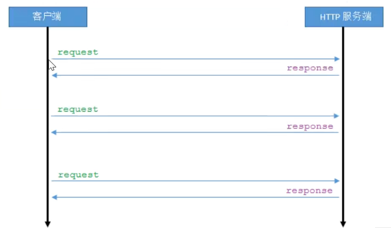

**websocket协议:**

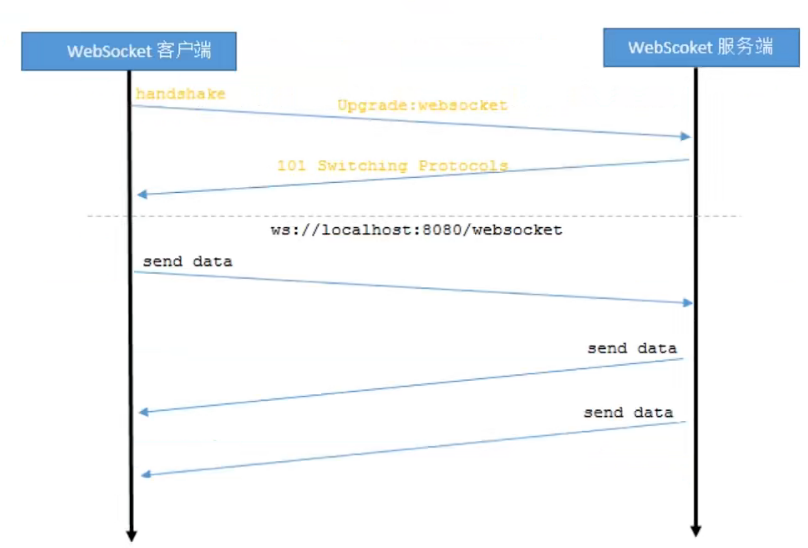

## 1.2websocket协议

本协议有两部分:握手和数据传输。

握手是基于http协议的。

来自客户端的握手看起来像如下形式:

```http
GET ws://localhost/chat HTTP/1.1
Host: localhost
Upgrade: websocket
Connection: Upgrade
Sec-WebSocket-Key: dGh1IHNhbXBszSBub25jzQ==
sec-websocket-Extensions: permessage-deflate
Sec-WebSocket-Version: 13
```

来自服务器的握手看配来像如下形式:

```http
HTTP/1.1 101 Switching Protocols
Upgrade: websocket
Connection: Upgrade
Sec-WebSocket-Accept: fFBooB7FAkLlXgRSz0BT3v4hq5s=
sec-websocket-Extensions : permessage-deflate
```

字段说明：

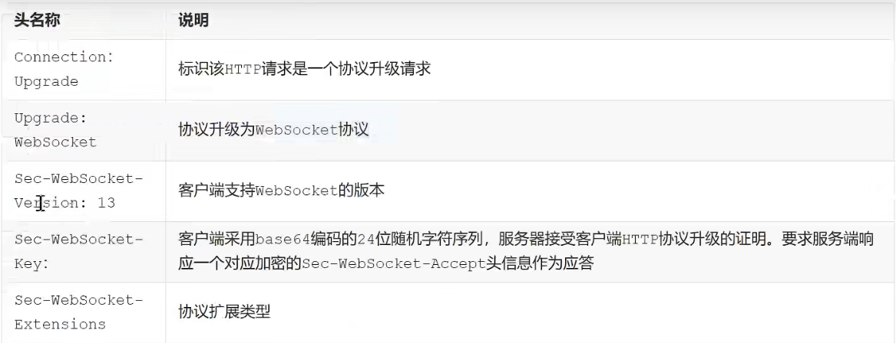

## 1.3 客户端(浏览器)实现

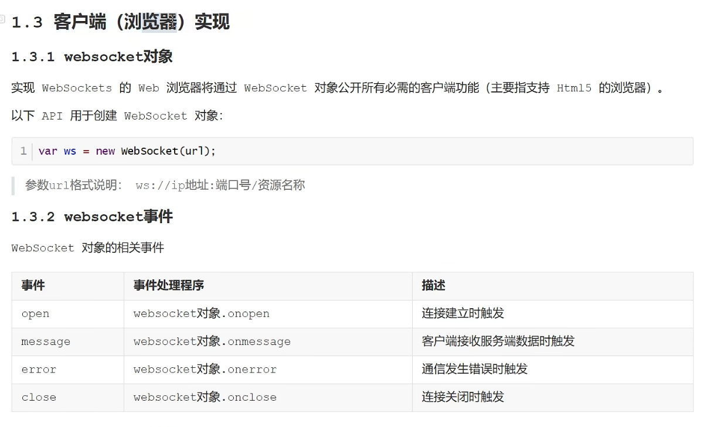


## 1.4 服务端实现


Tomcat的7.0.5 版本开始支持websocket,并且实现了Java webSocket规范(JSR356)。

Java WebSocket应用由一系列的websocketEndpoint组成。Endgoint 是一个java对象，代表**webSocket链接的一端**，对于服务端，我们可以视为处理具体websocket消息的接口，就像servlet之与http请求一样。

我们可以通过两种方式定义Endpoint:

- 第一种是编程式，即继承类javax.websocket.Endpoint并实现其方法。

- 第二种是注解式，即定义一个PoJo，并添加@serverEndpoint相关注解。


Endpoint实例在webSocket握手时创建，并在客户端与服务端链接过程中有效，最后在链接关闭时结束。在Endpoint接口中明确定义了与其生命周期相关的方法，规范实现者确保生命周期的各个阶段调用实例的相关方法。生命周期方法如下:

| 方法    | 含义描述                                                     | 注解     |
| ------- | ------------------------------------------------------------ | -------- |
| onclose | 当会话关闭时调用。                                           | @onclose |
| onOpen  | 当开启一个新的会话时调用，该方法是客户端与服务端握手成功后调用的方法。 | @onOpen  |
| onError | 当连接过程中异常时调用。                                     | @onError |


### 服务端如何接收客户端发送的数据呢?

通过为 session添加MessageHandler消息处理器来接收消息，当采用注解方式定义Endpoint时，我们还可以通过onMelsage 注解指定接收消息的方法。

### 服务端如何推送数据给客户端呢?

发送消息则由 RemoteEndpoint 完成，其实例由session 维护，根据使用情况，我们可以通过
Session.getBasicRemote 获取同步消息发送的实例，然后调用其sendXxx ()方法就可以发送消息，可以通过session.getAsyncRemote获取异步消息发送实例。


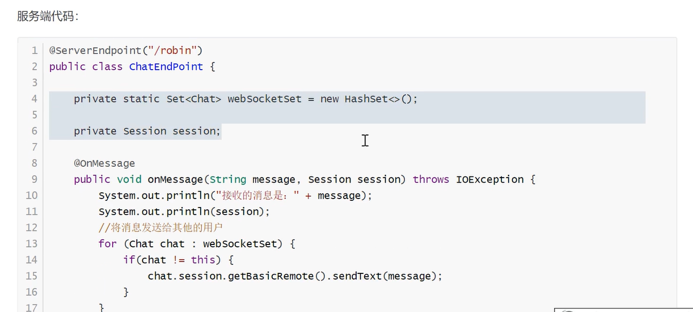

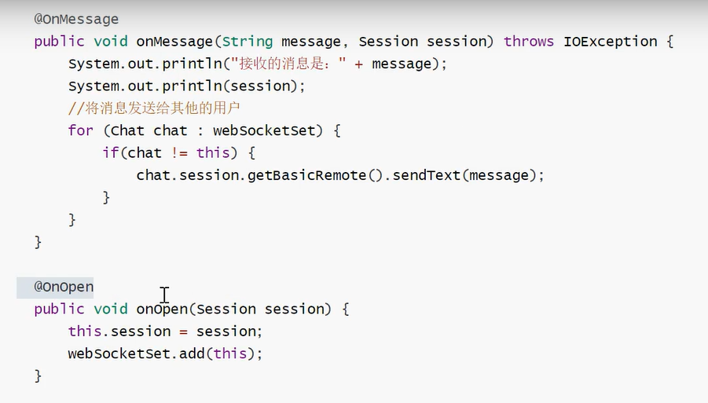

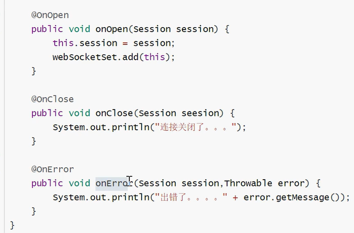


# 2基于WebSocket的网页聊天室

2.1懦求
通过websocket实现一个简易的聊天室功能。

1) ．登陆聊天室

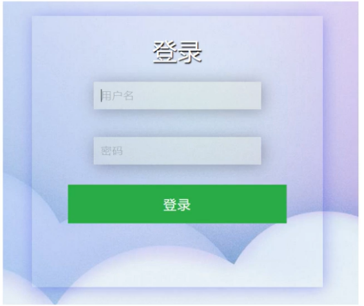

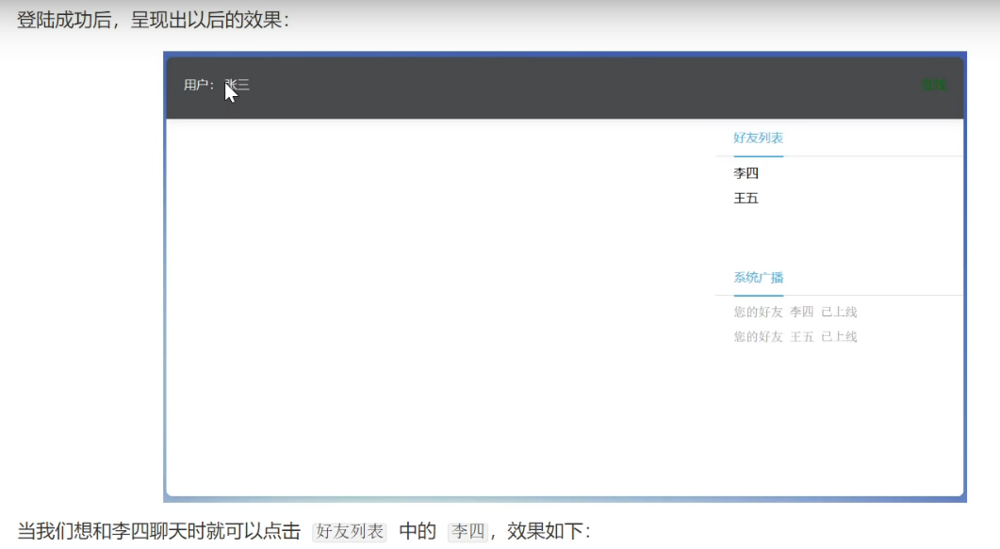

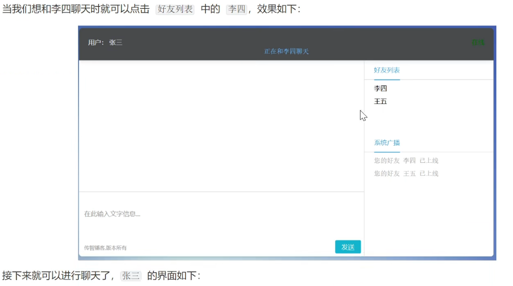

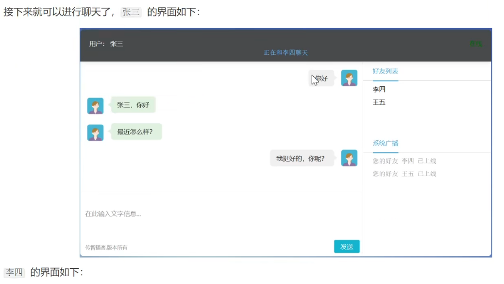

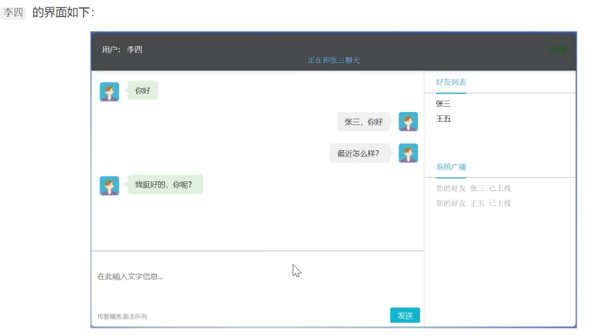

## 2.2实现流程

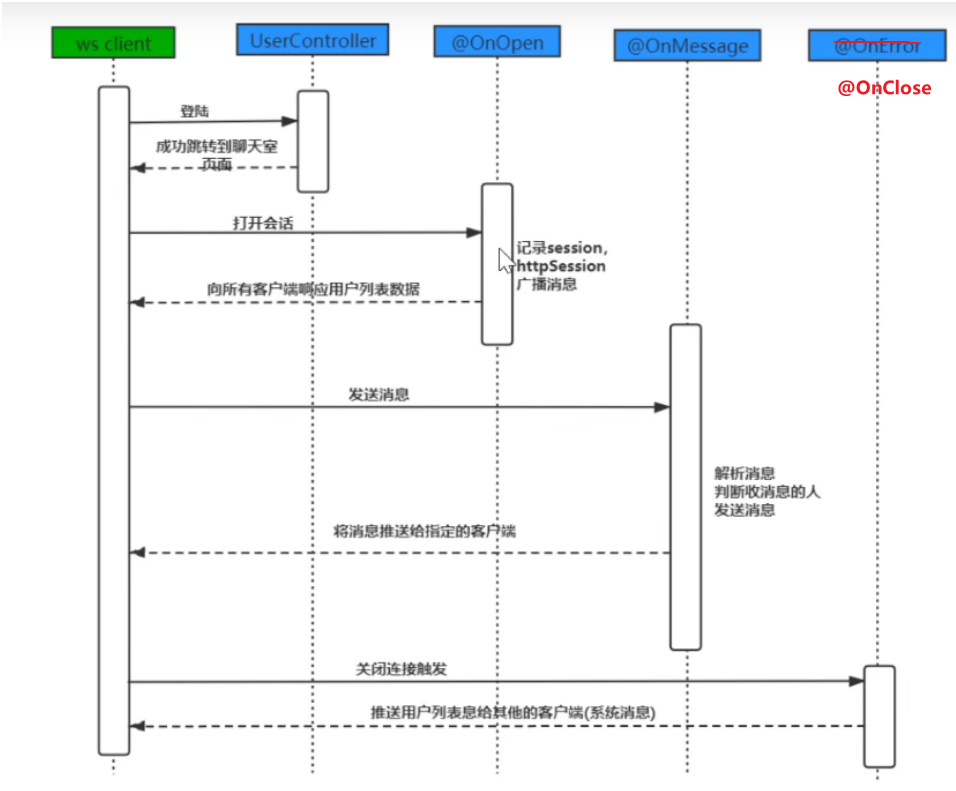


## 2.4功能实现

### 2.4.1 创建项目，导入相关jar包的坐标


```xml
<dependency>
    <groupId>org.springframework.boot</groupId>
    <artifactId>spring-boot-starter-websocket</artifactId>
</dependency>
<dependency>
    <groupId>org.springframework.boot</groupId>
    <artifactId>spring-boot-starter-web</artifactId>
</dependency>
<!--devtoo1s热部著-->
<dependency>
    <groupId>org.springframework.boot</groupId>
    <artifactId>spring-boot-devtools</artifactId>
    <scope>runtime</scope>
    <optional>true</optional>
</dependency>
```


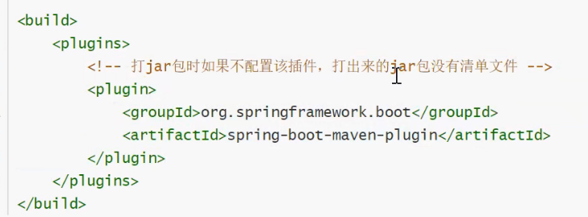

### 2.4.2 引入静态资源文件

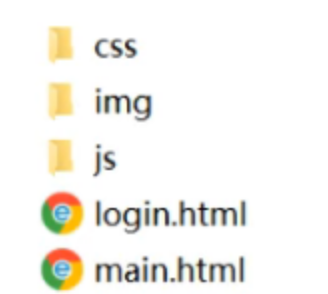

### 2.4 .3 引入公共资源

- pojo类

```java
/**
 * 浏览器发送给服务器的websocket数据.
 */

@Data
@AllArgsConstructor
@NoArgsConstructor
@Builder
public class Message {
    /** 接收方*/
    private String toName;
    /** 发送的数据 */
    private String message;

}
```


```java
/**
 * 服务端发送给客户端的websocket消息.
 */
@Data
@AllArgsConstructor
@NoArgsConstructor
@Builder
public class ResultMessage {
    /**
     * 是否是系统消息
     */
    private boolean systemMsgFlag;
    /**
     * 发送方Name
     */
    private String fromName;
    /**
     * 发送的数据
     */
    private Object message;

}
```


```java
/**
 * 登录后的响应（用于登录响应返回给浏览器的数据）.
 */
@Data
@AllArgsConstructor
@NoArgsConstructor
@Builder
public class Result {

    /**
     * 登录标志，成功/失败
     */
    private boolean flag;
    /**
     * 登录的响应消息
     */
    private String message;

}
```


```java
/**
用来封装消息的工具类
 * Date Time:      2021/5/24 15:03
 */
public class MessageUtils {

    /**
     * 封装响应的消息，注意:<b>系统消息的发送fromName为null</b>;封装好的响应如下，例如
     * 1.系统消息： {“isSystemMessage”: true, "fromName": null, "message": ["Name1", "Name2"]}.
     * 2. 非系统消息 {“isSystemMessage”: false, "fromName": "YYJ", "message": “你在哪里呀？”}.
     *
     * @param isSystemMessage 是否是系统消息
     * @param fromName        发送方名称
     * @param message         发送的消息内容
     * @return java.lang.String
     */
    public static String getMessage(boolean isSystemMessage, String fromName, Object message) {
        ResultMessage resultMessage = new ResultMessage();
        resultMessage.setSystemMsgFlag(isSystemMessage);
        resultMessage.setMessage(message);
        //如果不是系统消息，就传入fromName
        if (!isSystemMessage) {
            resultMessage.setFromName(fromName);
        }
        ObjectMapper objectMapper = new ObjectMapper();
        String repStr = null;
        try {
            repStr = objectMapper.writeValueAsString(resultMessage);
        } catch (JsonProcessingException e) {
            e.printStackTrace();
        }
        return repStr;
    }

}

```

### 2.4.4登陆功能实现

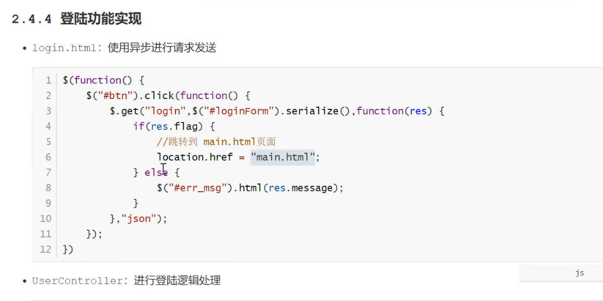

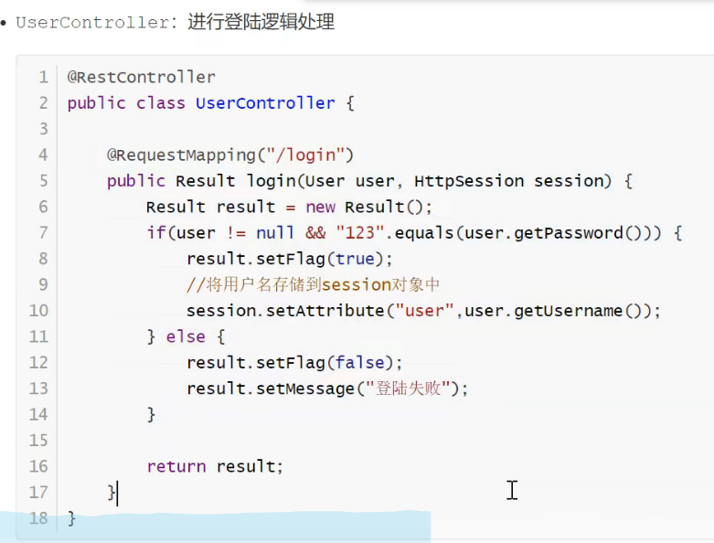

### 2.4.5获取当前登录的用户名

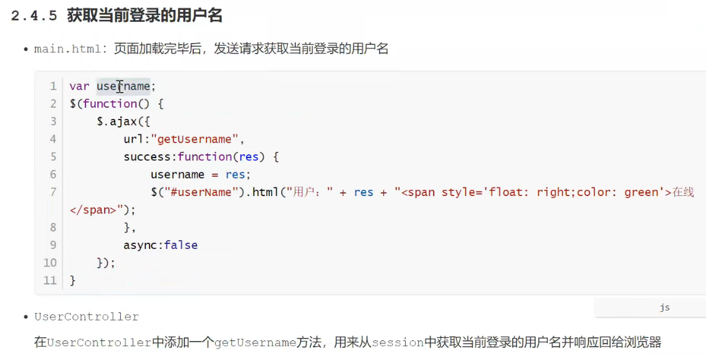


## 2.5 代码


```java
package com.mars.ws;

import com.fasterxml.jackson.core.JsonProcessingException;
import com.fasterxml.jackson.databind.ObjectMapper;
import com.mars.pojo.Message;
import com.mars.util.MessageUtils;
import org.apache.logging.log4j.LogManager;
import org.apache.logging.log4j.Logger;
import org.springframework.stereotype.Component;

import javax.servlet.http.HttpSession;
import javax.websocket.*;
import javax.websocket.server.ServerEndpoint;
import java.io.IOException;
import java.util.Map;
import java.util.Set;
import java.util.concurrent.ConcurrentHashMap;

/**

 * Date Time:      2021/5/24 22:40
 */


@ServerEndpoint(value = "/chat", configurator = GetHttpSessionConfigurator.class)
@Component
public class ChatEndpoint {

    private final static Logger LOGGER = LogManager.getLogger(ChatEndpoint.class);

    /**
     * 用来储存在线用户的容器
     * 用来存储每一个客户端对象对应的ChatEndpoint对象
     */

    public static Map<String, ChatEndpoint> onlineUsers = new ConcurrentHashMap<>();

    /**
     * 用来给客户端发送消息
     * /声明session对象，通过该对象可以发送消息给指定的用户
     */
    private Session session;

    /**
     * 用来获取在登录成功后，放在httpsession域中存放的username
     * 声明一个HttpSession对象，我们之前在HttpSession对象中存储了用户名
     */
    private HttpSession httpSession;

    /**
     *
     *   连接建立时调用
     * @param session
     * @param endpointConfig
     */
    @OnOpen
    public void onOpen(Session session, EndpointConfig endpointConfig) {
        LOGGER.info("wbsocket建立连接onOpen！");
        //将局部的session对象赋值给成员session
        this.session = session;
        //获取httpsession对象
        HttpSession httpSession = (HttpSession) endpointConfig.getUserProperties().get(HttpSession.class.getName());
        this.httpSession = httpSession;
        //获取httpsession域中存放的username对应的值
        String username = (String) httpSession.getAttribute("username");
        //存放到onlineUsers中保存
        onlineUsers.put(username, this);
        //系统消息推送所有在线用户给客户端
        //封装系统推送消息,前端onmessage接收的数据
        String message = MessageUtils.getMessage(true, null, getAllOnlineUsername());
        broadcastMsgToAllOnlineUsers(message);
    }

    /**
     * .
     * @param message 给客户端发送消息
     * @return void
     */
    private void broadcastMsgToAllOnlineUsers(String message) {
        //所有登录用户名称
        Set<String> names = onlineUsers.keySet();
        for (String name : names) {
            ChatEndpoint chatEndpoint = onlineUsers.get(name);
            //获取推送对象
            RemoteEndpoint.Basic basicRemote = chatEndpoint.session.getBasicRemote();
            try {
                basicRemote.sendText(message);
            } catch (IOException e) {
                LOGGER.error("广播发送系统消息失败！{}", e);
                e.printStackTrace();
            }
        }
    }

    /**
     * 获取发送给客户端的消息，消息数据示例值：{“systemMsgFlag”: true, "fromName": null, "message": ["Name1", "Name2"]}.
     * @return java.lang.Object
     */
    private Object getAllOnlineUsername() {
        return ChatEndpoint.onlineUsers.keySet();
    }


    /**
     * 接收到客户端发送的数据时调用.
     * @param message 客户端发送的数据
     * @param session session对象
     * @return void
     */
    @OnMessage
    public void onMessage(String message, Session session) {
        ObjectMapper objectMapper = new ObjectMapper();
        try {
            Message msg = objectMapper.readValue(message, Message.class);
            //获取接收信息的用户
            String toName = msg.getToName();
            //获取发送的消息
            String msgData = msg.getMessage();
            //获取当前登录的用户
            String username = (String) httpSession.getAttribute("username");
            //封装发送的消息
            String sendMsg = MessageUtils.getMessage(false, username, msgData);
            //发送消息
            onlineUsers.get(toName).session.getBasicRemote().sendText(sendMsg);
        } catch (JsonProcessingException e) {
            LOGGER.error("接收客户端的消息，转换出错了！");
            e.printStackTrace();
        } catch (IOException e) {
            e.printStackTrace();
        }
    }


    /**
     * 连接关闭时调用
     * @param session
     */
    @OnClose
    public void onClose(Session session) {
        String username = (String) httpSession.getAttribute("username");
        //
        ChatEndpoint remove = onlineUsers.remove(username);
        //广播
        String message = MessageUtils.getMessage(true, null, getAllOnlineUsername());
        broadcastMsgToAllOnlineUsers(message);
    }

}

```

### WebSocketConfig

```
@Configuration
public class WebSocketConfig {  

    /** 扫描注解了@ServerEndpoint注解的类，将其注册 */
    @Bean
    public ServerEndpointExporter serverEndpointExporter() {
        return new ServerEndpointExporter();  
    }  
  
} 
```


```java
/**
 * 用来获取HttpSession对象.
 */
public class GetHttpSessionConfigurator extends ServerEndpointConfig.Configurator {


    @Override
    public void modifyHandshake(ServerEndpointConfig sec, HandshakeRequest request, HandshakeResponse response) {
        //获取httpsession对象
        HttpSession httpSession = (HttpSession) request.getHttpSession();
        //存放httpsession对象
        Map<String, Object> userProperties = sec.getUserProperties();
        userProperties.put(HttpSession.class.getName(), httpSession);
    }
}


```

**将两者关联起来**

```java
@ServerEndpoint(value = "/chat", configurator = GetHttpSessionConfigurator.class)
```


> 温馨提示：现在都是**第三方支持聊天**，如极光，学这个用于自己项目完全没问题，大项目不建议使用


# other

## 说到 websocket 我觉得有必要说下跟 socket 的区别。

软件通信有七层结构，下三层结构偏向与数据通信，上三层更偏向于数据处理，中间的传输层则是连接上三层与下三层之间的桥梁，每一层都做不同的工作，上层协议依赖与下层协议。基于这个通信结构的概念。

Socket 其实并不是一个协议，是应用层与 TCP/IP 协议族通信的中间软件抽象层，它是一组接口。当两台主机通信时，让 Socket 去组织数据，以符合指定的协议。TCP 连接则更依靠于底层的 IP 协议，IP 协议的连接则依赖于链路层等更低层次。

WebSocket 则是一个典型的应用层协议。

总的来说：Socket 是传输控制层协议，WebSocket 是应用层协议。

## Websocket 使用 ws 或 wss 的统一资源标志符，类似于 HTTPS，其中 wss 表示在 TLS 之上的 Websocket。如：

```
ws://example.com/wsapi
wss://secure.example.com/
```

Websocket 使用和 HTTP 相同的 TCP 端口，可以绕过大多数防火墙的限制。默认情况下，Websocket 协议使用 80 端口；运行在 TLS 之上时，默认使用 443 端口。

**一个典型的Websocket握手请求如下：**

客户端请求

```http
GET / HTTP/1.1
Upgrade: websocket
Connection: Upgrade
Host: example.com
Origin: http://example.com
Sec-WebSocket-Key: sN9cRrP/n9NdMgdcy2VJFQ==
Sec-WebSocket-Version: 13
```

服务器回应

```http
HTTP/1.1 101 Switching Protocols
Upgrade: websocket
Connection: Upgrade
Sec-WebSocket-Accept: fFBooB7FAkLlXgRSz0BT3v4hq5s=
Sec-WebSocket-Location: ws://example.com/
```

-  Connection 必须设置 Upgrade，表示客户端希望连接升级。
-  Upgrade 字段必须设置 Websocket，表示希望升级到 Websocket 协议。
-  Sec-WebSocket-Key 是随机的字符串，服务器端会用这些数据来构造出一个 SHA-1 的信息摘要。把 “Sec-WebSocket-Key” 加上一个特殊字符串 “258EAFA5-E914-47DA-95CA-C5AB0DC85B11”，然后计算 SHA-1 摘要，之后进行 BASE-64 编码，将结果做为 “Sec-WebSocket-Accept” 头的值，返回给客户端。如此操作，可以尽量避免普通 HTTP 请求被误认为 Websocket 协议。
-  Sec-WebSocket-Version 表示支持的 Websocket 版本。RFC6455 要求使用的版本是 13，之前草案的版本均应当弃用。
-  Origin 字段是可选的，通常用来表示在浏览器中发起此 Websocket 连接所在的页面，类似于 Referer。但是，与 Referer 不同的是，Origin 只包含了协议和主机名称。
-  其他一些定义在 HTTP 协议中的字段，如 Cookie 等，也可以在 Websocket 中使用。

在服务器方面，网上都有不同对websocket支持的服务器：

- php - http://code.google.com/p/phpwebsocket/
- jetty - http://jetty.codehaus.org/jetty/（版本7开始支持websocket）
- netty - http://www.jboss.org/netty
- ruby - http://github.com/gimite/web-socket-ruby
- Kaazing - https://web.archive.org/web/20100923224709/http://www.kaazing.org/confluence/display/KAAZING/Home
- Tomcat - [http://tomcat.apache.org/（7.0.27支持websocket，建议用tomcat8，7.0.27中的接口已经过时）](http://tomcat.apache.org/)
- WebLogic - [http://www.oracle.com/us/products/middleware/cloud-app-foundation/weblogic/overview/index.html（12.1.2開始支持）](http://www.oracle.com/us/products/middleware/cloud-app-foundation/weblogic/overview/index.html)
- node.js - https://github.com/Worlize/WebSocket-Node
- node.js - [http://socket.io](http://socket.io/)
- nginx - http://nginx.com/
- mojolicious - http://mojolicio.us/
- python - https://github.com/abourget/gevent-socketio
- Django - https://github.com/stephenmcd/django-socketio
- erlang - https://github.com/ninenines/cowboy.git

# 相关链接

视频：https://www.bilibili.com/video/BV1r54y1D72U?spm_id_from=333.337.search-card.all.click

代码地址：https://github.com/codeOflI/websocket-chatroom-demo

本地地址:D:\Codes\java\old\WebSocket\websocket-chatroom-demo