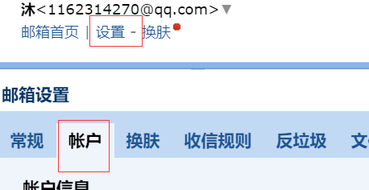

## spring-boot实现邮件任务 

•邮件发送需要引入spring-boot-starter-mail

•Spring Boot 自动配置MailSenderAutoConfiguration

•定义MailProperties内容，配置在application.yml中

•自动装配JavaMailSender

•测试邮件发送

**1.导入依赖**

```xml
<!-- mail-starter -->
<dependency>
    <groupId>org.springframework.boot</groupId>
    <artifactId>spring-boot-starter-mail</artifactId>
</dependency>
```

**2.配置信息**

1)首先在qq邮箱开通相关的服务




**拿到的授权码即为password**

application.properties配置

```properties
## QQ邮箱配置
spring.mail.host=smtp.qq.com
spring.mail.port=465
#发送的QQ邮箱
spring.mail.username=1162314270@qq.com
# 如果是qq邮箱,这个地方是授权码 ,不是密码
spring.mail.password=wfqdxxxvsgiecf(自己的授权码)
spring.mail.properties.mail.smtp.starttls.enable=true
spring.mail.properties.mail.smtp.starttls.required=true
spring.mail.properties.mail.smtp.ssl.enable=true
spring.mail.default-encoding=utf-8
spring.mail.properties.mail.smtp.ssl.trust=smtp.qq.com
#SSL证书Socket工厂
spring.mail.properties.mail.smtp.socketFactory.class=javax.net.ssl.SSLSocketFactory
#使用SMTPS协议465端口
spring.mail.properties.mail.smtp.socketFactory.port=465
spring.mail.properties.mail.smtp.auth=true
#503错误，我的没有这个错
#spring.mail.properties.mail.smtp.ssl.enable=true
```


```java
@RunWith(SpringRunner.class)
@SpringBootTest
public class Springboot04TaskApplicationTests {

    @Autowired
    JavaMailSenderImpl mailSender;

    @Test
    public void contextLoads() {
        SimpleMailMessage message = new SimpleMailMessage();
        //邮件设置
        message.setSubject("通知-今晚开会");
        message.setText("今晚7:30开会");

        message.setTo("407820388@qq.com");
        message.setFrom("1162314270@qq.com");

        mailSender.send(message);
    }


    @Test
    public void test02() throws  Exception{
        //1、创建一个复杂的消息邮件
        MimeMessage mimeMessage = mailSender.createMimeMessage();
        MimeMessageHelper helper = new MimeMessageHelper(mimeMessage, true);

        //邮件设置
        helper.setSubject("通知-今晚开会");
        helper.setText("<b style='color:red'>今天 7:30 开会</b>",true);

        helper.setTo("407820388@qq.com");
        helper.setFrom("1162314270@qq.com");

        //上传文件
        helper.addAttachment("1.jpg",new File("E:\\pictures\\desktop view.png"));
        helper.addAttachment("2.jpg",new File("E:\\pictures\\e.png"));

        mailSender.send(mimeMessage);

    }
}

```

### 实现邮箱激活链接

学习来自 https://www.cnblogs.com/smfx1314/p/10332330.html

```java
public class User {
    /**
     * 状态：0代表未激活，1代表激活
     */
    private Integer status;
    /**
     * 利用UUID生成一段数字，发动到用户邮箱，当用户点击链接时
     * 在做一个校验如果用户传来的code跟我们发生的code一致，更改状态为“1”来激活用户
     */
    private String  code;
```

说明：

- 用户状态status：0代表未激活，1代表激活，注册的时候，默认是0，只有激活邮箱激活码可以更改为1
- 邮箱激活码code：利用UUID生成一段数字，发动到用户邮箱，当用户点击链接时，在做一个校验，如果用户传来的code跟我们发送的code一致，更改状态为“1”来激活用户

```java
public interface UserDao {
    /**
     * 用户注册，注册的时候默认状态为0：未激活，并且调用邮件服务发送激活码到邮箱
     * @param user
     */
    void register(User user);

    /**
     * 点击邮箱中的激活码进行激活，根据激活码查询用户，之后再进行修改用户状态为1进行激活
     * @param code
     * @return
     */
    User checkCode(String code);

    /**
     * 激活账户，修改用户状态为“1”进行激活
     * @param user
     */
    void updateUserStatus(User user);

    /**
     * 登录，根据用户状态为“1”来查询
     * @param user
     * @return
     */
    User loginUser(User user);
}
```

### UUIDUtils 随机生成激活码

```java
public class UUIDUtils {
    public static String getUUID(){
        return UUID.randomUUID().toString().replace("-","");
    }
}
```

### UserController控制类

```java
@Controller
@RequestMapping("/user")
public class UserController {

    @Autowired
    private UserService userService;

    /**
     * 注册
     * @param user
     * @return
     */
    @RequestMapping(value = "/registerUser")
    public String register(User user){
        user.setStatus(0);
        String code = UUIDUtils.getUUID()+ UUIDUtils.getUUID();
        user.setCode(code);
        userService.register(user);
        return "success";
    }

    /**
     *校验邮箱中的code激活账户
     * 首先根据激活码code查询用户，之后再把状态修改为"1"
     */
    @RequestMapping(value = "/checkCode")
    public String checkCode(String code){
        User user = userService.checkCode(code);
        System.out.println(user);
        //如果用户不等于null，把用户状态修改status=1
       if (user !=null){
           user.setStatus(1);
           //把code验证码清空，已经不需要了
           user.setCode("");
           System.out.println(user);
           userService.updateUserStatus(user);
       }
        return "login";
    }

    /**
     * 跳转到登录页面
     * @return login
     */
    @RequestMapping(value = "/loginPage")
    public String login(){
        return "login";
    }

    /**
     * 登录
     */
    @RequestMapping(value = "/loginUser")
    public String login(User user, Model model){
        User u = userService.loginUser(user);
        if (u !=null){
            return "welcome";
        }
        return "login";
    }
}
```

```java
@Repository
@Mapper
public interface UserMapper {
    //根据激活码code查询用户
    @Select("select * from user where code = #{code}")
    User checkCode(String code);

    //    激活账户，修改用户状态
    @Update("update user set status=1,code=null WHERE user_id = #{userId}")
    void updateUserStatus(Integer userId);

    //    根据用户名，返回激活状态的用户
    @Select("SELECT * FROM `user` WHERE username = #{username} and status = 1  LIMIT 1")
    User getActiveUserByName(String username);
```

public class EmailSender {

    @Value("${spring.mail.username}")
    private String from;
    @Autowired
    EmailCache emailCache;
    @Autowired
    JavaMailSenderImpl mailSender;
    
    /**
     * @Description: 发送注册邮件和验证码,send email is take long time so add async
     * @Param: [email]
     * @return: java.lang.String null:发送邮件失败
     * @Author: lmz
     * @Date: 2019/10/20
     */
    @Async
    public String sendResetPasswordEmail(String email) {
        String checkCode = String.valueOf(new Random().nextInt(899999) + 100000);
        try{
            //发送邮件
            sendEmailMessage(email, "YOJ重置验证码",
                    "您的重置验证码为：" + checkCode);
        }catch (Exception e){
            e.printStackTrace();
            return null;
        }
        //设置缓存
        emailCache.setEmailCheckCode(email,checkCode);
        return checkCode;
    }
    
    /**
     * @Description: 发送注册邮件和验证码
     * @Param: [email]
     * @return: java.lang.String null:发送邮件失败
     * @Author: lmz
     * @Date: 2019/10/20
     */
    @Async
    public String sendRegisterEmail(String email) {
        //删除缓存

EmailSender


```java
public class EmailSender {
    @Value("${spring.mail.username}")
    private String from;
    @Autowired
    EmailCache emailCache;
    @Autowired
    JavaMailSenderImpl mailSender;

    /**
     * 发送HTML邮件
     * @param to 收件者
     * @param subject 邮件主题
     * @param content 文本内容
     */
    public void sendHtmlMail(String to,String subject,String content) {
        MimeMessage message = mailSender.createMimeMessage();
        MimeMessageHelper helper = null;
        try {
            helper = new MimeMessageHelper(message, true);
            helper.setFrom(from);
            helper.setTo(subject);
            helper.setTo(to);
            helper.setText(content, true);
            mailSender.send(message);
            //日志信息
            log.info("邮件已经发送。");
        } catch (MessagingException e) {
            log.error("发送邮件时发生异常！", e);
        }
    }
}
```

}