# Seaborn

[kaggle-seaborn](https://www.kaggle.com/learn/data-visualization)

[官网导学网址](https://seaborn.pydata.org/tutorial.html)

## Data Visualization

Make great data visualizations. A great way to see the power of coding!

# Hello, Seaborn

Your first introduction to coding for data visualization

## Welcome to Data Visualization!

In this hands-on course, you'll learn how to take your data visualizations to the next level with [seaborn](https://seaborn.pydata.org/index.html), a powerful but easy-to-use data visualization tool. To use seaborn, you'll also learn a bit about how to write code in Python, a popular programming language. That said,

- the course is aimed at those with no prior programming experience, and
- each chart uses short and simple code, making seaborn much faster and easier to use than many other data visualization tools (*such as Excel, for instance*).

So, if you've never written a line of code, and you want to learn the ***bare minimum\*** to start making faster, more attractive plots today, you're in the right place! To take a peek at some of the charts you'll make, check out the figures below.


## Your coding environment

Take the time now to scroll quickly up and down this page. You'll notice that there are a lot of different types of information, including:

1. **text** (like the text you're reading right now!),
2. **code** (which is always contained inside a gray box called a **code cell**), and
3. **code output** (or the printed result from running code that always appears immediately below the corresponding code).

We refer to these pages as **Jupyter notebooks** (or, often just **notebooks**), and we'll work with them throughout the mini-course. Another example of a notebook can be found in the image below.

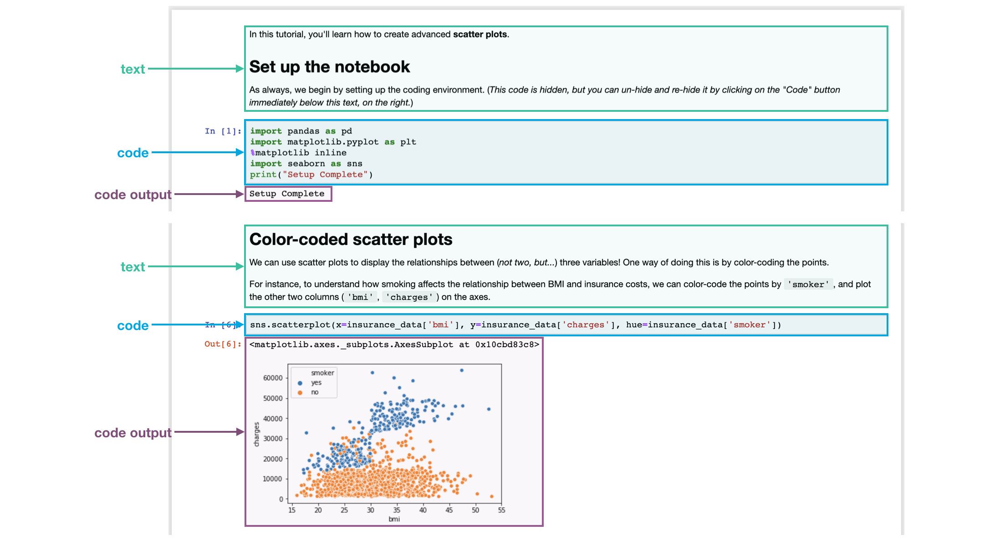

In the notebook you're reading now, we've already run all of the code for you. Soon, you will work with a notebook that allows you to write and run your own code!

## Set up the notebook

There are a few lines of code that you'll need to run at the top of every notebook to set up your coding environment. It's not important to understand these lines of code now, and so we won't go into the details just yet. (*Notice that it returns as output: `Setup Complete`.*)

In [1]:


```python
import pandas as pd
pd.plotting.register_matplotlib_converters()
import matplotlib.pyplot as plt
%matplotlib inline
import seaborn as sns
print("Setup Complete")
# Setup Complete
```

    Setup Complete


## Load the data

In this notebook, we'll work with a dataset of historical FIFA rankings for six countries: Argentina (ARG), Brazil (BRA), Spain (ESP), France (FRA), Germany (GER), and Italy (ITA). The dataset is stored as a CSV file (short for [comma-separated values file](https://bit.ly/2Iu5D4x). Opening the CSV file in Excel shows a row for each date, along with a column for each country.


To load the data into the notebook, we'll use two distinct steps, implemented in the code cell below as follows:

- begin by specifying the location (or [filepath](https://bit.ly/1lWCX7s)) where the dataset can be accessed, and then
- use the filepath to load the contents of the dataset into the notebook.

In [2]:


```python
## Path of the file to read
fifa_filepath = "./input_data/fifa.csv"

## Read the file into a variable fifa_data
fifa_data = pd.read_csv(fifa_filepath, index_col="Date", parse_dates=True)
```


Note that the code cell above has **four** different lines.

#### Comments

Two of the lines are preceded by a pound sign (`#`) and contain text that appears faded and italicized.

Both of these lines are completely ignored by the computer when the code is run, and they only appear here so that any human who reads the code can quickly understand it. We refer to these two lines as **comments**, and it's good practice to include them to make sure that your code is readily interpretable.

#### Executable code

The other two lines are **executable code**, or code that is run by the computer (*in this case, to find and load the dataset*).

The first line sets the value of `fifa_filepath` to the location where the dataset can be accessed. In this case, we've provided the filepath for you (in quotation marks). *Note that the **comment** immediately above this line of **executable code** provides a quick description of what it does!*

The second line sets the value of `fifa_data` to contain all of the information in the dataset. This is done with `pd.read_csv`. It is immediately followed by three different pieces of text (underlined in the image above) that are enclosed in parentheses and separated by commas. These are used to customize the behavior when the dataset is loaded into the notebook:

- `fifa_filepath` - The filepath for the dataset always needs to be provided first.
- `index_col="Date"` - When we load the dataset, we want each entry in the first column to denote a different row. To do this, we set the value of `index_col` to the name of the first column (`"Date"`, found in cell A1 of the file when it's opened in Excel).
- `parse_dates=True` - This tells the notebook to understand the each row label as a date (as opposed to a number or other text with a different meaning).

These details will make more sense soon, when you have a chance to load your own dataset in a hands-on exercise.

> For now, it's important to remember that the end result of running both lines of code is that we can now access the dataset from the notebook by using `fifa_data`.

By the way, you might have noticed that these lines of code don't have any output (whereas the lines of code you ran earlier in the notebook returned `Setup Complete` as output). This is expected behavior -- not all code will return output, and this code is a prime example!

## Examine the data

Now, we'll take a quick look at the dataset in `fifa_data`, to make sure that it loaded properly.

We print the *first* five rows of the dataset by writing one line of code as follows:

- begin with the variable containing the dataset (in this case, `fifa_data`), and then
- follow it with `.head()`.

You can see this in the line of code below.

In [3]:


```python
## Print the first 5 rows of the data
fifa_data.head()
```

Out[3]:

|            | ARG  | BRA  | ESP  | FRA  | GER  | ITA  |
| :--------- | :--- | :--- | :--- | :--- | :--- | :--- |
| Date       |      |      |      |      |      |      |
| 1993-08-08 | 5.0  | 8.0  | 13.0 | 12.0 | 1.0  | 2.0  |
| 1993-09-23 | 12.0 | 1.0  | 14.0 | 7.0  | 5.0  | 2.0  |
| 1993-10-22 | 9.0  | 1.0  | 7.0  | 14.0 | 4.0  | 3.0  |
| 1993-11-19 | 9.0  | 4.0  | 7.0  | 15.0 | 3.0  | 1.0  |
| 1993-12-23 | 8.0  | 3.0  | 5.0  | 15.0 | 1.0  | 2.0  |

Check now that the first five rows agree with the image of the dataset (*from when we saw what it would look like in Excel*) above.

## Plot the data

In this course, you'll learn about many different plot types. In many cases, you'll only need one line of code to make a chart!

For a sneak peek at what you'll learn, check out the code below that generates a line chart.

In [4]:


```python
## Set the width and height of the figure
plt.figure(figsize=(16,6))

## Line chart showing how FIFA rankings evolved over time 
sns.lineplot(data=fifa_data)
```


    <AxesSubplot:xlabel='Date'>


Out[4]:


```python
<AxesSubplot:xlabel='Date'>
```


This code shouldn't make sense just yet, and you'll learn more about it in the upcoming tutorials. For now, continue to your first exercise, where you'll get a chance to experiment with the coding environment yourself!

## What's next?

Write your first lines of code in the **[first coding exercise](https://www.kaggle.com/kernels/fork/3303713)**!

# Line Charts

Visualize trends over time

Now that you are familiar with the coding environment, it's time to learn how to make your own charts!

In this tutorial, you'll learn just enough Python to create professional looking **line charts**. Then, in the following exercise, you'll put your new skills to work with a real-world dataset.

## Set up the notebook

We begin by setting up the coding environment. (*This code is hidden, but you can un-hide it by clicking on the "Code" button immediately below this text, on the right.*)

*unfold_more*Show hidden cell

## Select a dataset

The dataset for this tutorial tracks global daily streams on the music streaming service [Spotify](https://en.wikipedia.org/wiki/Spotify). We focus on five popular songs from 2017 and 2018:

1. "Shape of You", by Ed Sheeran [(link)](https://bit.ly/2tmbfXp)
2. "Despacito", by Luis Fonzi [(link)](https://bit.ly/2vh7Uy6)
3. "Something Just Like This", by The Chainsmokers and Coldplay [(link)](https://bit.ly/2OfSsKk)
4. "HUMBLE.", by Kendrick Lamar [(link)](https://bit.ly/2YlhPw4)
5. "Unforgettable", by French Montana [(link)](https://bit.ly/2oL7w8b)

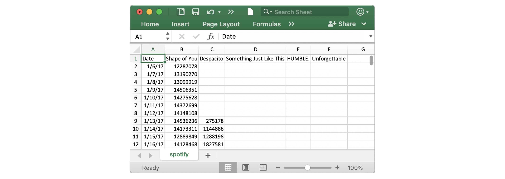

Notice that the first date that appears is January 6, 2017, corresponding to the release date of "The Shape of You", by Ed Sheeran. And, using the table, you can see that "The Shape of You" was streamed 12,287,078 times globally on the day of its release. Notice that the other songs have missing values in the first row, because they weren't released until later!

## Load the data

As you learned in the previous tutorial, we load the dataset using the `pd.read_csv` command.

In [2]:


```python
## Path of the file to read
spotify_filepath = "./input_data/spotify.csv"

## Read the file into a variable spotify_data
spotify_data = pd.read_csv(spotify_filepath, index_col="Date", parse_dates=True)
```

The end result of running both lines of code above is that we can now access the dataset by using `spotify_data`.

## Examine the data

We can print the *first* five rows of the dataset by using the `head` command that you learned about in the previous tutorial.

In [3]:


```python
## Print the first 5 rows of the data
spotify_data.head()
```

Out[3]:

|            | Shape of You | Despacito | Something Just Like This | HUMBLE. | Unforgettable |
| :--------- | :----------- | :-------- | :----------------------- | :------ | :------------ |
| Date       |              |           |                          |         |               |
| 2017-01-06 | 12287078     | NaN       | NaN                      | NaN     | NaN           |
| 2017-01-07 | 13190270     | NaN       | NaN                      | NaN     | NaN           |
| 2017-01-08 | 13099919     | NaN       | NaN                      | NaN     | NaN           |
| 2017-01-09 | 14506351     | NaN       | NaN                      | NaN     | NaN           |
| 2017-01-10 | 14275628     | NaN       | NaN                      | NaN     | NaN           |

Check now that the first five rows agree with the image of the dataset (*from when we saw what it would look like in Excel*) above.

> Empty entries will appear as `NaN`, which is short for "Not a Number".

We can also take a look at the *last* five rows of the data by making only one small change (where `.head()` becomes `.tail()`):


```python
## Print the last five rows of the data
spotify_data.tail()
```

Out[4]:

|            | Shape of You | Despacito | Something Just Like This | HUMBLE.   | Unforgettable |
| :--------- | :----------- | :-------- | :----------------------- | :-------- | :------------ |
| Date       |              |           |                          |           |               |
| 2018-01-05 | 4492978      | 3450315.0 | 2408365.0                | 2685857.0 | 2869783.0     |
| 2018-01-06 | 4416476      | 3394284.0 | 2188035.0                | 2559044.0 | 2743748.0     |
| 2018-01-07 | 4009104      | 3020789.0 | 1908129.0                | 2350985.0 | 2441045.0     |
| 2018-01-08 | 4135505      | 2755266.0 | 2023251.0                | 2523265.0 | 2622693.0     |
| 2018-01-09 | 4168506      | 2791601.0 | 2058016.0                | 2727678.0 | 2627334.0     |

Thankfully, everything looks about right, with millions of daily global streams for each song, and we can proceed to plotting the data!

## Plot the data

Now that the dataset is loaded into the notebook, we need only one line of code to **make a line chart!**

In [5]:


```python
## Line chart showing daily global streams of each song 
sns.lineplot(data=spotify_data)
```

Out[5]:


```python
<AxesSubplot:xlabel='Date'>
```


As you can see above, the line of code is relatively short and has two main components:

- ```python
  sns.lineplot
  ```

   

  tells the notebook that we want to create a line chart.

  - *Every command that you learn about in this course will start with `sns`, which indicates that the command comes from the [seaborn](https://seaborn.pydata.org/) package. For instance, we use `sns.lineplot` to make line charts. Soon, you'll learn that we use `sns.barplot` and `sns.heatmap` to make bar charts and heatmaps, respectively.*

- `data=spotify_data` selects the data that will be used to create the chart.

Note that you will always use this same format when you create a line chart, and ***the only thing that changes with a new dataset is the name of the dataset\***. So, if you were working with a different dataset named `financial_data`, for instance, the line of code would appear as follows:


```python
sns.lineplot(data=financial_data)
```

Sometimes there are additional details we'd like to modify, like the size of the figure and the title of the chart. Each of these options can easily be set with a single line of code.

### add title


```python
## Set the width and height of the figure
plt.figure(figsize=(14,6))

## Add title
plt.title("Daily Global Streams of Popular Songs in 2017-2018")

## Line chart showing daily global streams of each song 
sns.lineplot(data=spotify_data)
```

Out[6]:


```python
<AxesSubplot:title={'center':'Daily Global Streams of Popular Songs in 2017-2018'}, xlabel='Date'>
```


The first line of code sets the size of the figure to `14` inches (in width) by `6` inches (in height). To set the size of *any figure*, you need only copy the same line of code as it appears. Then, if you'd like to use a custom size, change the provided values of `14` and `6` to the desired width and height.

The second line of code sets the title of the figure. Note that the title must *always* be enclosed in quotation marks (`"..."`)!

## Plot a subset of the data

So far, you've learned how to plot a line for *every* column in the dataset. In this section, you'll learn how to plot a *subset* of the columns.

We'll begin by printing the names of all columns. This is done with one line of code and can be adapted for any dataset by just swapping out the name of the dataset (in this case, `spotify_data`).

In [7]:


```python
list(spotify_data.columns)
```

Out[7]:


```python
['Shape of You',
 'Despacito',
 'Something Just Like This',
 'HUMBLE.',
 'Unforgettable']
```

In the next code cell, we plot the lines corresponding to the first two columns in the dataset.

### add xlabel-name


```python
## Set the width and height of the figure
plt.figure(figsize=(14,6))

## Add title
plt.title("Daily Global Streams of Popular Songs in 2017-2018")

## Line chart showing daily global streams of 'Shape of You'
sns.lineplot(data=spotify_data['Shape of You'], label="Shape of You")

## Line chart showing daily global streams of 'Despacito'
sns.lineplot(data=spotify_data['Despacito'], label="Despacito")

## Add label for horizontal axis
plt.xlabel("Date")
```

Out[8]:


```python
Text(0.5, 0, 'Date')
```

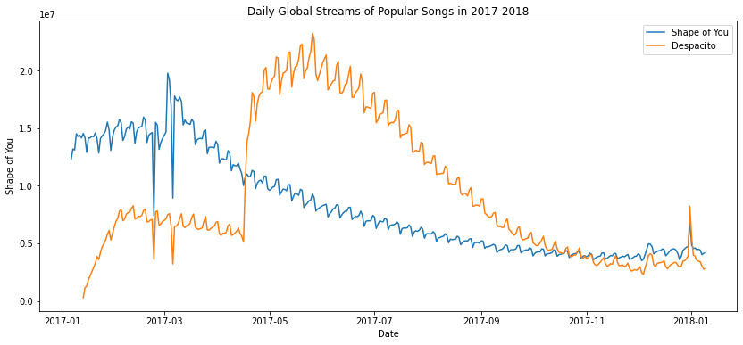

The first two lines of code set the title and size of the figure (*and should look very familiar!*).

The next two lines each add a line to the line chart. For instance, consider the first one, which adds the line for "Shape of You":


```python
## Line chart showing daily global streams of 'Shape of You'
sns.lineplot(data=spotify_data['Shape of You'], label="Shape of You")
```

This line looks really similar to the code we used when we plotted every line in the dataset, but it has a few key differences:

- Instead of setting `data=spotify_data`, we set `data=spotify_data['Shape of You']`. In general, to plot only a single column, we use this format with putting the name of the column in single quotes and enclosing it in square brackets. (*To make sure that you correctly specify the name of the column, you can print the list of all column names using the command you learned above.*)
- We also add `label="Shape of You"` to make the line appear in the legend and set its corresponding label.

The final line of code modifies the label for the horizontal axis (or x-axis), where the desired label is placed in quotation marks (`"..."`).

## What's next?

Put your new skills to work in a **[coding exercise](https://www.kaggle.com/kernels/fork/3303716)**!

# Bar Charts and Heatmaps

Use color or length to **compare categories in a dataset**

Now that you can create your own line charts, it's time to learn about more chart types!

> By the way, if this is your first experience with writing code in Python, you should be *very proud* of all that you have accomplished so far, because it's never easy to learn a completely new skill! If you stick with the course, you'll notice that everything will only get easier (while the charts you'll build will get more impressive!), since the code is pretty similar for all of the charts. Like any skill, coding becomes natural over time, and with repetition.

In this tutorial, you'll learn about **bar charts** and **heatmaps**.

## Set up the notebook

As always, we begin by setting up the coding environment. (*This code is hidden, but you can un-hide it by clicking on the "Code" button immediately below this text, on the right.*)

```python
import pandas as pd
pd.plotting.register_matplotlib_converters()
import matplotlib.pyplot as plt
%matplotlib inline
import seaborn as sns
print("Setup Complete")
```


## Select a dataset

In this tutorial, we'll work with a dataset from the US Department of Transportation that tracks flight delays.

Opening this CSV file in Excel shows a row for each month (where `1` = January, `2` = February, etc) and a column for each airline code.

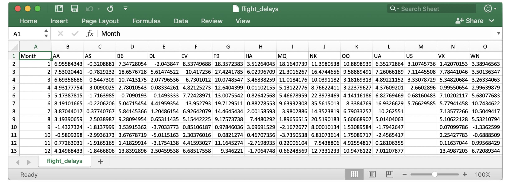

Each entry shows the average arrival delay (in minutes) for a different airline and month (all in year 2015). Negative entries denote flights that (*on average*) tended to arrive early. For instance, the average American Airlines flight (*airline code: **AA***) in January arrived roughly 7 minutes late, and the average Alaska Airlines flight (*airline code: **AS***) in April arrived roughly 3 minutes early.

## Load the data

As before, we load the dataset using the `pd.read_csv` command.

In [2]:


```python
## Path of the file to read
flight_filepath = "./input_data/flight_delays.csv"

## Read the file into a variable flight_data
flight_data = pd.read_csv(flight_filepath, index_col="Month")
```

You may notice that the code is slightly shorter than what we used in the previous tutorial. In this case, since the row labels (from the `'Month'` column) don't correspond to dates, we don't add `parse_dates=True` in the parentheses. But, we keep the first two pieces of text as before, to provide both:

- the filepath for the dataset (in this case, `flight_filepath`), and
- the name of the column that will be used to index the rows (in this case, `index_col="Month"`).

## Examine the data

Since the dataset is small, we can easily print all of its contents. This is done by writing a single line of code with just the name of the dataset.

In [3]:


```python
## Print the data
flight_data
```

Out[3]:

|       | AA        | AS        | B6        | DL        | EV        | F9        | HA        | MQ        | NK        | OO        | UA        | US       | VX        | WN        |
| :---- | :-------- | :-------- | :-------- | :-------- | :-------- | :-------- | :-------- | :-------- | :-------- | :-------- | :-------- | :------- | :-------- | :-------- |
| Month |           |           |           |           |           |           |           |           |           |           |           |          |           |           |
| 1     | 6.955843  | -0.320888 | 7.347281  | -2.043847 | 8.537497  | 18.357238 | 3.512640  | 18.164974 | 11.398054 | 10.889894 | 6.352729  | 3.107457 | 1.420702  | 3.389466  |
| 2     | 7.530204  | -0.782923 | 18.657673 | 5.614745  | 10.417236 | 27.424179 | 6.029967  | 21.301627 | 16.474466 | 9.588895  | 7.260662  | 7.114455 | 7.784410  | 3.501363  |
| 3     | 6.693587  | -0.544731 | 10.741317 | 2.077965  | 6.730101  | 20.074855 | 3.468383  | 11.018418 | 10.039118 | 3.181693  | 4.892212  | 3.330787 | 5.348207  | 3.263341  |
| 4     | 4.931778  | -3.009003 | 2.780105  | 0.083343  | 4.821253  | 12.640440 | 0.011022  | 5.131228  | 8.766224  | 3.223796  | 4.376092  | 2.660290 | 0.995507  | 2.996399  |
| 5     | 5.173878  | -1.716398 | -0.709019 | 0.149333  | 7.724290  | 13.007554 | 0.826426  | 5.466790  | 22.397347 | 4.141162  | 6.827695  | 0.681605 | 7.102021  | 5.680777  |
| 6     | 8.191017  | -0.220621 | 5.047155  | 4.419594  | 13.952793 | 19.712951 | 0.882786  | 9.639323  | 35.561501 | 8.338477  | 16.932663 | 5.766296 | 5.779415  | 10.743462 |
| 7     | 3.870440  | 0.377408  | 5.841454  | 1.204862  | 6.926421  | 14.464543 | 2.001586  | 3.980289  | 14.352382 | 6.790333  | 10.262551 | NaN      | 7.135773  | 10.504942 |
| 8     | 3.193907  | 2.503899  | 9.280950  | 0.653114  | 5.154422  | 9.175737  | 7.448029  | 1.896565  | 20.519018 | 5.606689  | 5.014041  | NaN      | 5.106221  | 5.532108  |
| 9     | -1.432732 | -1.813800 | 3.539154  | -3.703377 | 0.851062  | 0.978460  | 3.696915  | -2.167268 | 8.000101  | 1.530896  | -1.794265 | NaN      | 0.070998  | -1.336260 |
| 10    | -0.580930 | -2.993617 | 3.676787  | -5.011516 | 2.303760  | 0.082127  | 0.467074  | -3.735054 | 6.810736  | 1.750897  | -2.456542 | NaN      | 2.254278  | -0.688851 |
| 11    | 0.772630  | -1.916516 | 1.418299  | -3.175414 | 4.415930  | 11.164527 | -2.719894 | 0.220061  | 7.543881  | 4.925548  | 0.281064  | NaN      | 0.116370  | 0.995684  |
| 12    | 4.149684  | -1.846681 | 13.839290 | 2.504595  | 6.685176  | 9.346221  | -1.706475 | 0.662486  | 12.733123 | 10.947612 | 7.012079  | NaN      | 13.498720 | 6.720893  |

## Bar chart

Say we'd like to create a bar chart showing the average arrival delay for Spirit Airlines (*airline code: **NK***) flights, by month.

In [4]:


```python
## Set the width and height of the figure
plt.figure(figsize=(10,6))

## Add title
plt.title("Average Arrival Delay for Spirit Airlines Flights, by Month")

## Bar chart showing average arrival delay for Spirit Airlines flights by month
sns.barplot(x=flight_data.index, y=flight_data['NK'])

## Add label for vertical axis
plt.ylabel("Arrival delay (in minutes)")
```

Out[4]:


```python
Text(0, 0.5, 'Arrival delay (in minutes)')
```


The commands for customizing the text (title and vertical axis label) and size of the figure are familiar from the previous tutorial. The code that creates the bar chart is new:


```python
## Bar chart showing average arrival delay for Spirit Airlines flights by month
sns.barplot(x=flight_data.index, y=flight_data['NK'])
```

It has three main components:

- ```
  sns.barplot
  ```

   

  \- This tells the notebook that we want to create a bar chart.

  - *Remember that `sns` refers to the [seaborn](https://seaborn.pydata.org/) package, and all of the commands that you use to create charts in this course will start with this prefix.*

- `x=flight_data.index` - This determines what to use on the horizontal axis. In this case, we have selected the column that ***index\***es the rows (in this case, the column containing the months).

- `y=flight_data['NK']` - This sets the column in the data that will be used to determine the height of each bar. In this case, we select the `'NK'` column.

> **Important Note**: You must select the indexing column with `flight_data.index`, and it is not possible to use `flight_data['Month']` (*which will return an error*). This is because when we loaded the dataset, the `"Month"` column was used to index the rows. **We always have to use this special notation to select the indexing column.**

### 横着画图

xlabel名字太长，横着画更好

```python
# Set the width and height of the figure
plt.figure(figsize=(8, 6))
# Bar chart showing average score for racing games by platform
sns.barplot(x=ign_data['Racing'], y=ign_data.index)
# Add label for horizontal axis
plt.xlabel("")
# Add label for vertical axis
plt.title("Average Score for Racing Games, by Platform")
```

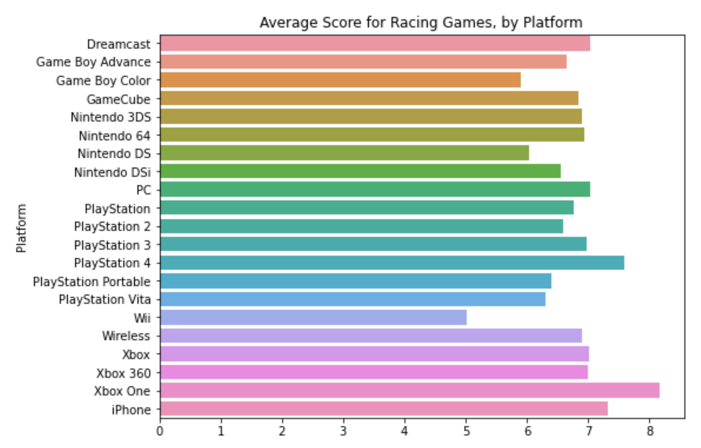

## Heatmap

热图是heatmap的直译，用暖色表示数值大，冷色表示数值小。行为基因，列为样本。

We have one more plot type to learn about: **heatmaps**!

In the code cell below, we create a heatmap to quickly visualize patterns in `flight_data`. Each cell is color-coded according to its corresponding value.

In [5]:


```python
## Set the width and height of the figure
plt.figure(figsize=(14,7))

## Add title
plt.title("Average Arrival Delay for Each Airline, by Month")

## Heatmap showing average arrival delay for each airline by month
sns.heatmap(data=flight_data, annot=True)

## Add label for horizontal axis
plt.xlabel("Airline")
```

Out[5]:


```python
Text(0.5, 42.0, 'Airline')
```


linkcode

The relevant code to create the heatmap is as follows:


```python
## Heatmap showing average arrival delay for each airline by month
sns.heatmap(data=flight_data, annot=True)
```

This code has three main components:

- `sns.heatmap` - This tells the notebook that we want to create a heatmap.
- `data=flight_data` - This tells the notebook to use all of the entries in `flight_data` to create the heatmap.
- `annot=True` - This ensures that the values for each cell appear on the chart. (*Leaving this out removes the numbers from each of the cells!*)

*What patterns can you detect in the table? For instance, if you look closely, the months toward the end of the year (especially months 9-11) appear relatively dark for all airlines. This suggests that airlines are better (on average) at keeping schedule during these months!*

## What's next?

Create your own visualizations with a **[coding exercise](https://www.kaggle.com/kernels/fork/2951537)**!

# Scatter Plots

**散点图，**散布图

Leverage the coordinate plane to **explore relationships between variables**

In this tutorial, you'll learn how to create advanced **scatter plots**.

## Set up the notebook

As always, we begin by setting up the coding environment. (*This code is hidden, but you can un-hide it by clicking on the "Code" button immediately below this text, on the right.*)

In [1]:

```
import pandas as pd
pd.plotting.register_matplotlib_converters()
import matplotlib.pyplot as plt
%matplotlib inline
import seaborn as sns
print("Setup Complete")
Setup Complete
```

## Load and examine the data

We'll work with a (*synthetic*) dataset of insurance charges, to see if we can understand why some customers pay more than others.


If you like, you can read more about the dataset [here](https://www.kaggle.com/mirichoi0218/insurance/home).

In [2]:

```
# Path of the file to read
insurance_filepath = "../input/insurance.csv"

# Read the file into a variable insurance_data
insurance_data = pd.read_csv(insurance_filepath)
```

As always, we check that the dataset loaded properly by printing the first five rows.

In [3]:

```
insurance_data.head()
```

Out[3]:

|      | age  | sex    | bmi    | children | smoker | region    | charges     |
| :--- | :--- | :----- | :----- | :------- | :----- | :-------- | :---------- |
| 0    | 19   | female | 27.900 | 0        | yes    | southwest | 16884.92400 |
| 1    | 18   | male   | 33.770 | 1        | no     | southeast | 1725.55230  |
| 2    | 28   | male   | 33.000 | 3        | no     | southeast | 4449.46200  |
| 3    | 33   | male   | 22.705 | 0        | no     | northwest | 21984.47061 |
| 4    | 32   | male   | 28.880 | 0        | no     | northwest | 3866.85520  |

## Scatter plots

To create a simple **scatter plot**, we use the `sns.scatterplot` command and specify the values for:

- the horizontal x-axis (`x=insurance_data['bmi']`), and
- the vertical y-axis (`y=insurance_data['charges']`).

In [4]:

```
sns.scatterplot(x=insurance_data['bmi'], y=insurance_data['charges'])
```

Out[4]:

```
<AxesSubplot:xlabel='bmi', ylabel='charges'>
```


The scatterplot above suggests that [body mass index](https://en.wikipedia.org/wiki/Body_mass_index) (BMI) and insurance charges are **positively correlated**, where customers with higher BMI typically also tend to pay more in insurance costs. (*This pattern makes sense, since high BMI is typically associated with higher risk of chronic disease.*)

###  **regression line**

To double-check the strength of this relationship, you might like to add a **regression line**, or the line that best fits the data. We do this by changing the command to `sns.regplot`.

In [5]:

```
sns.regplot(x=insurance_data['bmi'], y=insurance_data['charges'])
```

Out[5]:

```
<AxesSubplot:xlabel='bmi', ylabel='charges'>
```


## Color-coded scatter plots

We can use scatter plots to display the relationships between (*not two, but...*) three variables! One way of doing this is by color-coding the points.

For instance, to understand how smoking affects the relationship between BMI and insurance costs, we can color-code the points by `'smoker'`, and plot the other two columns (`'bmi'`, `'charges'`) on the axes.

In [6]:

```python
sns.scatterplot(x=insurance_data['bmi'], y=insurance_data['charges'], hue=insurance_data['smoker'])
```

Out[6]:

```
<AxesSubplot:xlabel='bmi', ylabel='charges'>
```


This scatter plot shows that while nonsmokers to tend to pay slightly more with increasing BMI, smokers pay MUCH more.

### `sns.lmplot` command to add two regression lines

To further emphasize this fact, we can use the `sns.lmplot` command to add two regression lines, corresponding to smokers and nonsmokers. (*You'll notice that the regression line for smokers has a much steeper slope, relative to the line for nonsmokers!*)

In [7]:

```python
sns.lmplot(x="bmi", y="charges", hue="smoker", data=insurance_data)
```

Out[7]:

```
<seaborn.axisgrid.FacetGrid at 0x7f76accd7590>
```

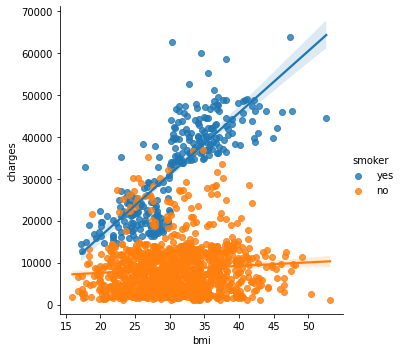

The `sns.lmplot` command above works slightly differently than the commands you have learned about so far:

- Instead of setting `x=insurance_data['bmi']` to select the `'bmi'` column in `insurance_data`, we set `x="bmi"` to specify the name of the column only.
- Similarly, `y="charges"` and `hue="smoker"` also contain the names of columns.
- We specify the dataset with `data=insurance_data`.

### categorical scatter plot

Finally, there's one more plot that you'll learn about, that might look slightly different from how you're used to seeing scatter plots. Usually, we use scatter plots to highlight the relationship between two continuous variables (like `"bmi"` and `"charges"`). However, we can adapt the design of the scatter plot to feature a categorical variable (like `"smoker"`) on one of the main axes. We'll refer to this plot type as a **categorical scatter plot**, and we build it with the `sns.swarmplot` command.

In [8]:

```python
sns.swarmplot(x=insurance_data['smoker'], y=insurance_data['charges'])
```

```
/opt/conda/lib/python3.7/site-packages/seaborn/categorical.py:1296: UserWarning: 67.3% of the points cannot be placed; you may want to decrease the size of the markers or use stripplot.
  warnings.warn(msg, UserWarning)
```

Out[8]:

```
<AxesSubplot:xlabel='smoker', ylabel='charges'>
```

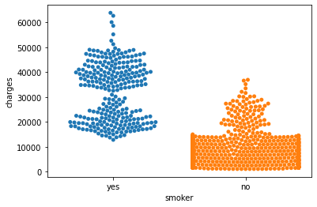

Among other things, this plot shows us that:

- on average, non-smokers are charged less than smokers, and
- the customers who pay the most are smokers; whereas the customers who pay the least are non-smokers.

## What's next?

Apply your new skills to solve a real-world scenario with a **[coding exercise](https://www.kaggle.com/kernels/fork/2951535)**!

# Distributions

Create histograms and density plots

**直方图(Histogram)**，又称[质量分布图](https://baike.baidu.com/item/质量分布图/824987)，是一种统计报告图，由一系列高度不等的纵向条纹或[线段](https://baike.baidu.com/item/线段/8679802)表示数据分布的情况。 一般用[横轴](https://baike.baidu.com/item/横轴/9910927)表示数据类型，纵轴表示分布情况。

**直方图和柱状图的区别是**：1、代表的意义不同，直方图所代表的是数据的具体分布，而柱状图所代表的则是数据的大小。2、X轴的意思不同，在直方图中X轴所代表的是定量数据，柱状图里面的X轴所代表的则是分类数据。所以直方图里面的柱子是不能随意移动的，而且X轴上的区间需要连续，但是柱状图上的柱子却能够随意的排序移动。3、柱子的形态不同，直方图上的柱子其宽度是可以不一样的，也就是有宽的，有窄的，但是柱状图上面的柱子宽度是需要一致的。因为柱状图上的宽度并没有数值的含义，但是直方图上面的柱子是代表了区间的长度，所以宽度是根据区间来调整的。

**密度图**表现与数据值对应的边界或域对象的一种理论图形表示方法。一般用于呈现连续变量

In this tutorial you'll learn all about **histograms** and **density plots**.

## Set up the notebook

As always, we begin by setting up the coding environment. (*This code is hidden, but you can un-hide it by clicking on the "Code" button immediately below this text, on the right.*)


In [1]:

```
import pandas as pd
pd.plotting.register_matplotlib_converters()
import matplotlib.pyplot as plt
%matplotlib inline
import seaborn as sns
print("Setup Complete")
Setup Complete
```

## Select a dataset

We'll work with a dataset of 150 different flowers, or 50 each from three different species of iris (*Iris setosa*, *Iris versicolor*, and *Iris virginica*).


## Load and examine the data

Each row in the dataset corresponds to a different flower. There are four measurements: the sepal length and width, along with the petal length and width. We also keep track of the corresponding species.

In [2]:

```
# Path of the file to read
iris_filepath = "../input/iris.csv"

# Read the file into a variable iris_data
iris_data = pd.read_csv(iris_filepath, index_col="Id")

# Print the first 5 rows of the data
iris_data.head()
```

Out[2]:

|      | Sepal Length (cm) | Sepal Width (cm) | Petal Length (cm) | Petal Width (cm) | Species     |
| :--- | :---------------- | :--------------- | :---------------- | :--------------- | :---------- |
| Id   |                   |                  |                   |                  |             |
| 1    | 5.1               | 3.5              | 1.4               | 0.2              | Iris-setosa |
| 2    | 4.9               | 3.0              | 1.4               | 0.2              | Iris-setosa |
| 3    | 4.7               | 3.2              | 1.3               | 0.2              | Iris-setosa |
| 4    | 4.6               | 3.1              | 1.5               | 0.2              | Iris-setosa |
| 5    | 5.0               | 3.6              | 1.4               | 0.2              | Iris-setosa |

## Histograms

Say we would like to create a **histogram** to see how petal length varies in iris flowers. We can do this with the `sns.histplot` command.

In [3]:

```python
# Histogram 
sns.histplot(iris_data['Petal Length (cm)'])
```

Out[3]:

```
<AxesSubplot:xlabel='Petal Length (cm)', ylabel='Count'>
```

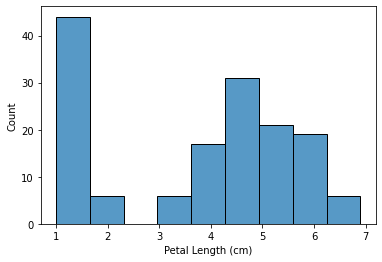

In the code cell above, we had to supply the command with the column we'd like to plot (*in this case, we chose `'Petal Length (cm)'`*).

## Density plots

The next type of plot is a **kernel density estimate (KDE)** plot. In case you're not familiar with KDE plots, **you can think of it as a smoothed histogram.**

To make a KDE plot, we use the `sns.kdeplot` command. Setting `shade=True` colors the area below the curve (*and `data=` chooses the column we would like to plot*).

In [4]:

```
# KDE plot 
sns.kdeplot(data=iris_data['Petal Length (cm)'], shade=True)
```

Out[4]:

```
<AxesSubplot:xlabel='Petal Length (cm)', ylabel='Density'>
```


## 2D KDE plots

We're not restricted to a single column when creating a KDE plot. We can create a **two-dimensional (2D) KDE plot** with the `sns.jointplot` command.

In the plot below, the color-coding shows us how likely we are to see different combinations of sepal width and petal length, where darker parts of the figure are more likely.

In [5]:

```
# 2D KDE plot
sns.jointplot(x=iris_data['Petal Length (cm)'], y=iris_data['Sepal Width (cm)'], kind="kde")
```

Out[5]:

```
<seaborn.axisgrid.JointGrid at 0x7f107667f1d0>
```


Note that in addition to the 2D KDE plot in the center,

- the curve at the top of the figure is a KDE plot for the data on the x-axis (in this case, `iris_data['Petal Length (cm)']`), and
- the curve on the right of the figure is a KDE plot for the data on the y-axis (in this case, `iris_data['Sepal Width (cm)']`).

## Color-coded plots

For the next part of the tutorial, we'll create plots to understand differences between the species.

We can create three different histograms (one for each species) of petal length by using the `sns.histplot` command (*as above*).

- `data=` provides the name of the variable that we used to read in the data
- `x=` sets the name of column with the data we want to plot
- `hue=` sets the column we'll use to split the data into different histograms

In [6]:

```python
# Histograms for each species
sns.histplot(data=iris_data, x='Petal Length (cm)', hue='Species')

# Add title
plt.title("Histogram of Petal Lengths, by Species")
```

Out[6]:

```
Text(0.5, 1.0, 'Histogram of Petal Lengths, by Species')
```

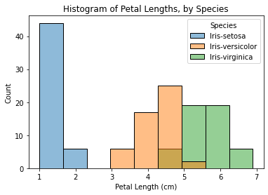

We can also create a KDE plot for each species by using `sns.kdeplot` (*as above*). The functionality for `data`, `x`, and `hue` are identical to when we used `sns.histplot` above. Additionally, we set `shade=True` to color the area below each curve.

In [7]:

```python
# KDE plots for each species
sns.kdeplot(data=iris_data, x='Petal Length (cm)', hue='Species', shade=True)

# Add title
plt.title("Distribution of Petal Lengths, by Species")
```

Out[7]:

```
Text(0.5, 1.0, 'Distribution of Petal Lengths, by Species')
```

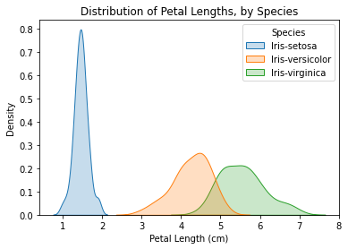

One interesting pattern that can be seen in plots is that the plants seem to belong to one of two groups, where *Iris versicolor* and *Iris virginica* seem to have similar values for petal length, while *Iris setosa* belongs in a category all by itself.

In fact, according to this dataset, we might even be able to classify any iris plant as *Iris setosa* (as opposed to *Iris versicolor* or *Iris virginica*) just by looking at the petal length: if the petal length of an iris flower is less than 2 cm, it's most likely to be *Iris setosa*!

## What's next?

Put your new skills to work in a **[coding exercise](https://www.kaggle.com/kernels/fork/2951534)**!

# Choosing Plot Types and Custom Styles

Customize your charts and make them look snazzy(*adj.*时髦的；漂亮的；新潮的)

In this course, you've learned how to create many different chart types. Now, you'll organize your knowledge, before learning some quick commands that you can use to change the style of your charts.

## What have you learned?


Since it's not always easy to decide how to best tell the story behind your data, we've broken the chart types into three broad categories to help with this.

- Trends\- A trend is defined as a pattern of change.
  - `sns.lineplot` - **Line charts** are best to show trends over a period of time, and multiple lines can be used to show trends in more than one group.
- Relationship\- There are many different chart types that you can use to understand relationships between variables in your data.
  - `sns.barplot` - **Bar charts** are useful for comparing **quantities** corresponding to different groups.
  - `sns.heatmap` - **Heatmaps** can be used to find color-coded patterns in tables of numbers.
  - `sns.scatterplot` - **Scatter plots** show the relationship between two continuous variables; if color-coded, we can also show the relationship with a third [categorical variable](https://en.wikipedia.org/wiki/Categorical_variable).
  - `sns.regplot` - Including a **regression line** in the scatter plot makes it easier to see any **linear relationship** between two variables.
  - `sns.lmplot` - This command is useful for drawing multiple regression lines, if the scatter plot contains multiple, color-coded groups.
  - `sns.swarmplot` - **Categorical scatter plots** show the relationship between a continuous variable and a categorical variable.
- Distribution\- We visualize distributions to show the possible values that we can expect to see in a variable, along with how likely they are.
  - `sns.histplot` - **Histograms** show the distribution of a single numerical variable.
  - `sns.kdeplot` - **KDE plots** (or **2D KDE plots**) show an estimated, smooth distribution of a single numerical variable (or two numerical variables).
  - `sns.jointplot` - This command is useful for simultaneously displaying a 2D KDE plot with the corresponding KDE plots for each individual variable.

## Changing styles with seaborn

```python
# Change the style of the figure to the "dark" theme
sns.set_style("dark")
```

All of the commands have provided a nice, default style to each of the plots. However, you may find it useful to customize how your plots look, and thankfully, this can be accomplished by just adding one more line of code!

As always, we need to begin by setting up the coding environment. (*This code is hidden, but you can un-hide it by clicking on the "Code" button immediately below this text, on the right.*)

```
import pandas as pd
pd.plotting.register_matplotlib_converters()
import matplotlib.pyplot as plt
%matplotlib inline
import seaborn as sns
print("Setup Complete")
```

We'll work with the same code that we used to create a line chart in a previous tutorial. The code below loads the dataset and creates the chart.

In [2]:

```
# Path of the file to read
spotify_filepath = "../input/spotify.csv"

# Read the file into a variable spotify_data
spotify_data = pd.read_csv(spotify_filepath, index_col="Date", parse_dates=True)

# Line chart 
plt.figure(figsize=(12,6))
sns.lineplot(data=spotify_data)
```

Out[2]:

```
<AxesSubplot:xlabel='Date'>
```

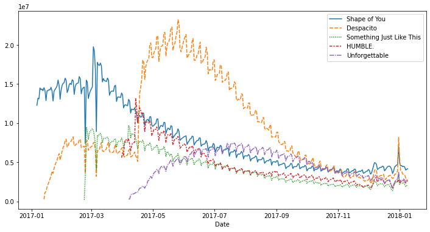

We can quickly change the style of the figure to a different theme with only a single line of code.

In [3]:

```python
# Change the style of the figure to the "dark" theme
sns.set_style("dark")

# Line chart 
plt.figure(figsize=(12,6))
sns.lineplot(data=spotify_data)
```

Out[3]:

```
<AxesSubplot:xlabel='Date'>
```

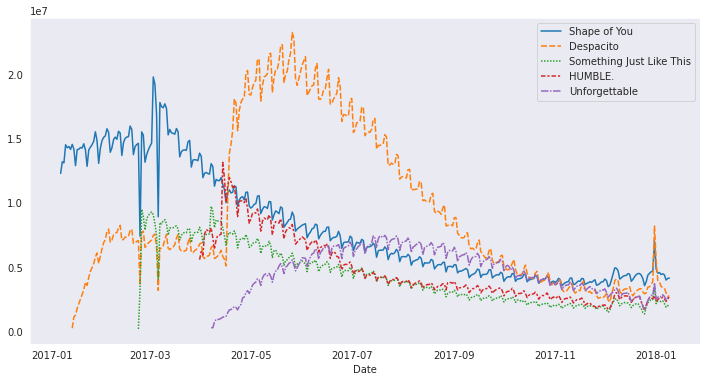

**Seaborn has five different themes:** (1)`"darkgrid"`, (2)`"whitegrid"`, (3)`"dark"`, (4)`"white"`, and (5)`"ticks"`, and you need only use a command similar to the one in the code cell above (with the chosen theme filled in) to change it.

In the upcoming exercise, you'll experiment with these themes to see which one you like most!

## What's next?

Explore seaborn styles in a quick **[coding exercise](https://www.kaggle.com/kernels/fork/2959763)**!

# 自己总结

FacetGrid

# Multi-plot grids

# Building structured multi-plot grids-绘制多个图形

[官方导学：](https://seaborn.pydata.org/tutorial/axis_grids.html)

相关链接：https://blog.csdn.net/zkx990121/article/details/122077587

[seaborn.FacetGrid-API](https://seaborn.pydata.org/generated/seaborn.FacetGrid.html?highlight=facetgrid#seaborn.FacetGrid)

```python
g = sns.FacetGrid(train_df, col='Survived')
g.map(plt.hist, 'Age', bins=20)
```

<!-- ![img]() -->

```python
grid = sns.FacetGrid(train_df, col='Survived', row='Pclass', height=2.2, aspect=1.6)
grid.map(plt.hist, 'Age', alpha=.5, bins=20)
grid.add_legend();
```

<!-- ![img]() -->

# 使用总结

## 使用seaborn在pycharm中画图不显示

解决方法：在代码后加上`plt.show()`即可：

```
## Add title
plt.title("Daily Global Streams of Popular Songs in 2017-2018")
pd.Series([1, 2, 3, 4, 5])
sns.lineplot(data=pd.Series(running_loss_list))
plt.show()
```


# 相关链接